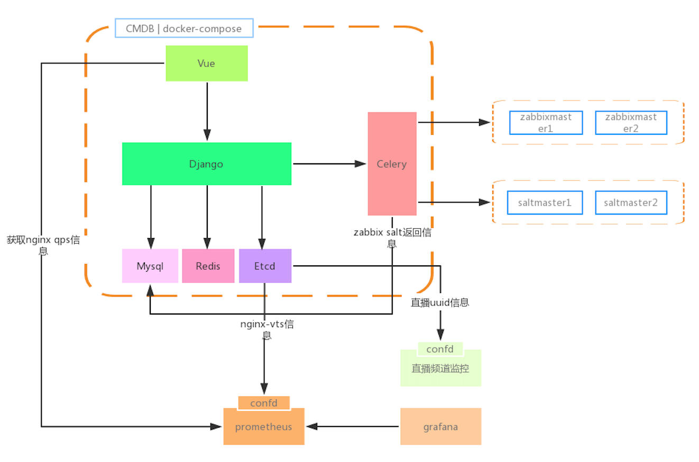

## 架构图

#  tabops_api

  
  
##### 基于Django REST framework + Vue + Element UI的前后端分离CMDB管理系统

## ✨ 特性

- 遵循 RESTful API 设计规范

- 基于 Django REST framework 框架，提供了丰富的中间件支持

- JWT 认证

- 服务器信息自动收集(基于celery 支持多salt master)

- 服务部署信息自动zabbix对接验证(基于celery 支持多zabbix)

- 支持在线生成API文档(基于rest_framework.documentation)

## License

[MIT]

Copyright (c) 2019-present plsof